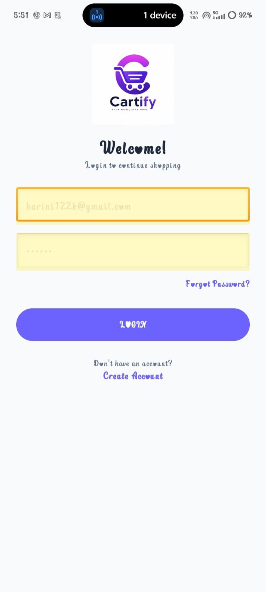

# 🛒 Cartify

Cartify is a modern Android shopping application developed using Java in Android Studio.

## ✨ Features
- User Login
- Home Screen
- Categories
- Product Listing
- Shopping Cart
- Wishlist
- Modern UI Design

## 🛠️ Tech Stack
- Java
- Android Studio
- RecyclerView
- Material Design
- Firebase 

## 📱 App Screenshots

### Login Screen

### Home Screen

### Cart Screen

### Profile Screen

## 🚀 Installation
1. Clone the repository
2. Open in Android Studio
3. Sync Gradle
4. Run the application

## 👩‍💻 Developed By
**Harini M**
